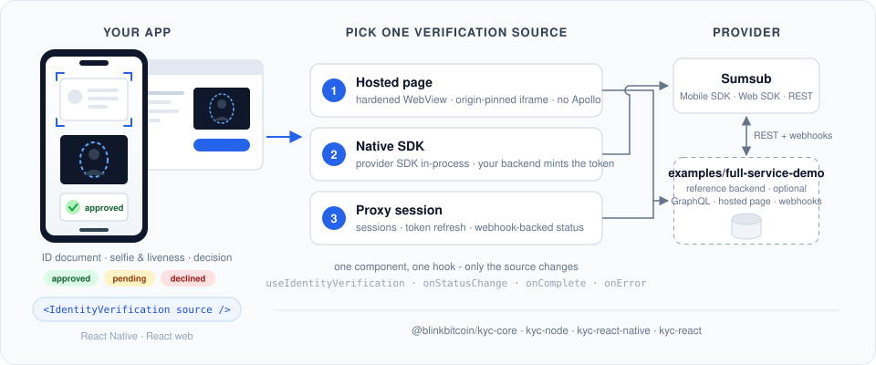

# kyc

[](https://github.com/blinkbitcoin/kyc/actions/workflows/ci.yml?query=branch%3Amain)
[](https://github.com/blinkbitcoin/kyc/actions/workflows/ci.yml?query=branch%3Amain)
[](https://github.com/blinkbitcoin/kyc/actions/workflows/ci.yml?query=branch%3Amain)
[](LICENSE)

<sub>Badges render once the first `main` run publishes them to `gh-pages`. E2E covers backend, web and Android; the iOS simulator suite is opt-in (macOS runners), see [CI/CD](docs/development-guide.md#ios-e2e-is-opt-in).</sub>

<p align="center">
  
</p>

Embedded identity verification (KYC) for React Native and React web apps.
One `Verification` component, one `useVerification` hook, provider-agnostic -
Sumsub is the default provider and the only one implemented, and the app
never learns its name.

The hard parts are the ones this library actually solves: camera and
microphone permissions inside a WebView (the `mediaCapturePermissionGrantType`
that WKWebView and Android both need), an origin-pinned `postMessage` channel
instead of an open one, token refresh that survives a slow reviewer, and a
webhook-backed status that a replayed callback cannot downgrade.

| Mode | What it is | What your app installs | Backend required |
|------|-----------|------------------------|------------------|
| **1. Native SDK** | The provider SDK runs in-process<br>(a React Native native module);<br>your app supplies an<br>access-token callback | `kyc-react-native` +<br>`kyc-sumsub` + the<br>Sumsub SDK peer | Any backend that<br>mints provider<br>access tokens |
| **2. Hosted page** | A page speaking the<br>`kyc-bridge` protocol, embedded<br>in a hardened WebView or an<br>origin-pinned iframe | One package via the<br>Apollo-free `/hosted`<br>entry - **no Apollo,<br>no GraphQL** | The page (this<br>repo's `apps/api`,<br>or your own) |
| **3. Proxy session** | Full orchestration: session<br>creation, token refresh,<br>webhook status sync,<br>status query | The package +<br>`@apollo/client` +<br>`graphql` | This repo's backend<br>service (`apps/api`) |

The GraphQL backend, the Apollo wiring and the provider adapters in this repo
exist for **mode 3 only**. If mode 1 or 2 covers you, none of that ships with
you - the [Integration](#integration) section walks each mode from simplest up.

## Integration

Every mode drives the **same component with the same callbacks** - the only
thing that changes is the `VerificationSource` you pass in:

```tsx
<Verification source={source} onComplete={…} onError={…} onCancel={…} />
```

The modes below go from simplest to most capable. **Start with the first one
that covers your needs.**

### 1. Hosted page - the simplest (no Apollo, no provider SDK)

**Use when:** you have, or can serve, a page that speaks the bridge protocol.
This repo's `apps/api` serves one at `GET /hosted/:sessionId`, and the whole
contract a page must honour is three bullet points.

```sh
npm i @blinkbitcoin/kyc-react-native react-native-webview @react-native-community/netinfo
# note: no @apollo/client, no graphql - the /hosted entry never reaches them
```

```tsx
import { createHostedSource, Verification } from '@blinkbitcoin/kyc-react-native/hosted';

const source = createHostedSource({
  getSession: async () => yourApi.startVerification(),   // -> { url }
  refreshToken: async (s) => yourApi.refreshToken(s.sessionId),   // optional
});

<Verification
  source={source}
  onComplete={(result) => console.log(result.status)}
  onError={(error) => console.warn(error.code, error.message)}
  onCancel={() => navigation.goBack()}
/>;
```

The WebView is hardened in one place (`mediaCapturePermissionGrantType: 'grant'`,
an origin allow-list, a navigation guard, no popups, no file access), and the
`allowedOrigin` the messages are pinned to is derived from the page url when
you do not supply one. Details, and the three things a **web** host page must
allow before a browser hands the frame a camera:
[docs/integration/hosted.md](docs/integration/hosted.md).

### 2. Native SDK - the best camera UX (one backend endpoint)

**Use when:** you are on mobile and want the provider's own full-screen
capture and liveness flow rather than a WebView. The provider SDK needs an
access token, and minting one needs a provider app token, which must never
sit in a mobile bundle - so this mode needs one authenticated endpoint on
your backend.

```sh
npm i @blinkbitcoin/kyc-react-native @blinkbitcoin/kyc-sumsub @sumsub/react-native-mobilesdk-module
cd ios && bundle exec pod install
```

```tsx
import { Verification } from '@blinkbitcoin/kyc-react-native';
import { createSumsubNativeSource } from '@blinkbitcoin/kyc-sumsub/react-native';

const source = createSumsubNativeSource({
  getAccessToken: async () => (await yourApi.startVerification()).accessToken,
});
```

No WebView is rendered: the component detects `isLaunchable(source)` and hands
the screen to the SDK. `getAccessToken` doubles as the SDK's own expiration
handler, so there is nothing to refresh. Without the SDK peer installed the
source fails closed with `SDK_UNAVAILABLE` rather than crashing - and
`createFakeLaunchableSource` from `@blinkbitcoin/kyc-core/testing` lets you
drive the whole launch branch in tests and E2E with no credentials at all.
[docs/integration/native-sdk.md](docs/integration/native-sdk.md).

### 3. Proxy session - full orchestration (this repo's backend service)

**Use when:** you want sessions, token refresh, provider webhooks and an
authoritative status handled for you, and you are willing to run `apps/api`.

```sh
npm i @blinkbitcoin/kyc-react-native @apollo/client graphql
```

1. Run the service and point it at your provider credentials:

```bash
make db-up migrate backend      # dev Postgres, migrations, server on :4000
```

2. Register `https://your-api/webhook/kyc/sumsub` in the provider dashboard.
3. Wire the client:

```tsx
import {
  createKycApolloClient,
  createProxySource,
  Verification,
} from '@blinkbitcoin/kyc-react-native';

const client = createKycApolloClient({ uri: API_URL, getAuthToken });
const source = createProxySource({ client, platform: 'IOS' });
```

The backend persists one `VerificationSession` row per attempt with an audit
trail, and its terminal-state guard means a replayed webhook can never
downgrade an `approved` user.
[docs/integration/proxy.md](docs/integration/proxy.md).

### Web apps

Everything above applies to `@blinkbitcoin/kyc-react`, with an origin-pinned
`<iframe>` in place of the WebView and `navigator.onLine` in place of NetInfo.
There is no `/hosted` subpath on the web and none is needed - the single entry
is side-effect-free, so a bundler drops what a hosted-only app never imports.
Start at [packages/kyc-react/README.md](packages/kyc-react/README.md) and
[docs/integration/hosted.md](docs/integration/hosted.md).

## Repository Layout

Ordered by how likely you are to need each part:

| Path | What lives there |
|------|------------------|
| [`packages/kyc-react-native/`](packages/kyc-react-native/README.md) | The React Native library you install:<br>`Verification`, `useVerification`, and the<br>hardened hosted WebView. |
| [`packages/kyc-react/`](packages/kyc-react/README.md) | The same pair for React web, over an<br>origin-pinned iframe. |
| [`packages/kyc-sumsub/`](packages/kyc-sumsub/README.md) | The only place Sumsub is named: the shared<br>status/event mapping and the native-SDK<br>source. Not needed for modes 2 and 3. |
| [`packages/kyc-core/`](packages/kyc-core/README.md) | The shared core both libraries build on:<br>`VerificationSource`, the capability guards,<br>the bridge protocol, the state machine and<br>the error-code contract. It arrives as a<br>dependency - you never install it directly. |
| [`apps/api/`](apps/api/README.md) | The reference backend: provider port, mock<br>and Sumsub adapters, webhooks, the hosted<br>page. Needed for mode 3 only. |
| [`examples/`](examples/README.md) | Two demo hosts - the executable integration<br>docs, and the Maestro / Playwright targets. |
| `docs/` | Documentation of how everything currently<br>works - start at [docs/index.md](docs/index.md). |

## Development

Only needed if you are working on the packages themselves - **consuming them
requires none of this**.

```sh
make install                             # npm ci across all workspaces (also installs git hooks)
direnv allow . && direnv allow apps/api  # once per machine (loads env + the nix flake dev shell)
```

**Working on the packages**

```sh
make test                                # unit suites + lint + typecheck + format check
make coverage                            # 100% on the four packages and apps/api
npm test -w @blinkbitcoin/kyc-react -- useVerification    # one suite
```

**Running the demos**

```sh
make db-up migrate backend               # the reference backend on :4000 (mock provider)
make start && make ios                   # RN demo (or: make android)
make web                                 # web demo on :5173
```

**Real Sumsub** is never exercised by CI. Point the backend at
`KYC_PROVIDER=sumsub` with sandbox credentials and follow the manual checklist
in [docs/integration/sumsub.md](docs/integration/sumsub.md).

`make help` lists all targets (thin wrappers over the npm workspace scripts):

| Target | Purpose |
|--------|---------|
| `make test`<br>`make coverage` | Unit suites + lint + typecheck + format check / coverage thresholds |
| `make check-ci`<br>`make shellcheck` | actionlint + shellcheck over the workflows and scripts |
| `make codegen`<br>`make codegen-check` | Emit `schema.graphql` and regenerate the client types / fail on drift |
| `make diagrams`<br>`make diagrams-check` | Render `docs/diagrams/dist/*.svg` and reassemble the page / fail on drift |
| `make docs-check` | Warn on architecture changes without docs; fail on a stale diagram SVG |
| `make e2e-backend` | Backend E2E with a dockerized Postgres |
| `make e2e-web`<br>`make e2e-web-proxy` | Playwright, hosted (`:5173`) and proxy (`:5174`) |
| `make e2e-android`<br>`make e2e-ios`<br>`make e2e-fake-native` | Maestro suites (see `make help` for the prerequisites) |
| `make version`<br>`make release V=X.Y.Z` | What CI would publish / cut the stable release |

Coverage is enforced at 100% on all four packages and `apps/api`, with an 80%
floor on the demos. See [docs/development-guide.md](docs/development-guide.md)
for the full workflow and [CONTRIBUTING.md](CONTRIBUTING.md) for commit and PR
conventions.

Built the way [blinkbitcoin/esign](https://github.com/blinkbitcoin/esign) was.
