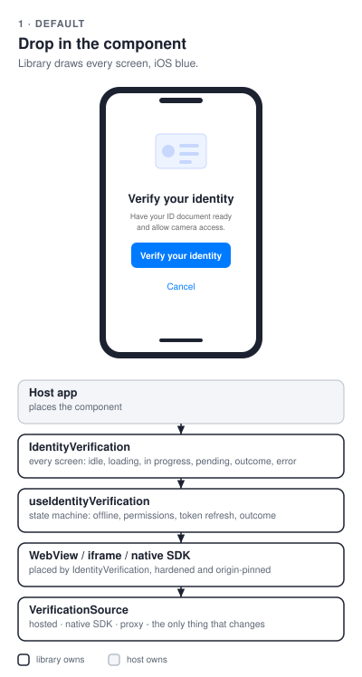
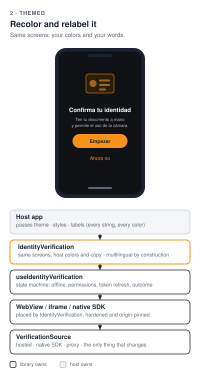
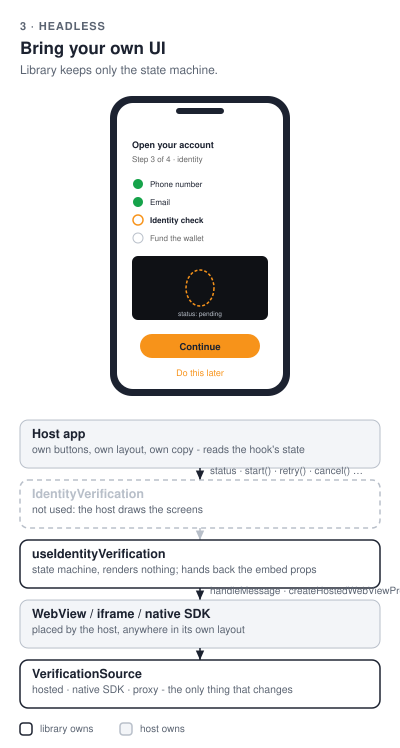

# kyc

[](https://github.com/blinkbitcoin/kyc/actions/workflows/ci.yml?query=branch%3Amain)
[](https://github.com/blinkbitcoin/kyc/actions/workflows/ci.yml?query=branch%3Amain)
[](https://github.com/blinkbitcoin/kyc/actions/workflows/ci.yml?query=branch%3Amain)
[](LICENSE)

<sub>E2E covers backend, web, Android and the iOS simulator suite on every push, see [Testing](#testing).</sub>

<p align="center">
  
</p>

Embedded identity verification (KYC) for React Native and React web apps.
One `IdentityVerification` component, one `useIdentityVerification` hook,
provider-agnostic - Sumsub is the default provider and the only one
implemented, and the app never learns its name. The end user photographs an
ID document, takes a selfie with a liveness check, and your app gets
`approved`, `pending` or `declined`.

The hard parts are the ones this library actually solves: camera and
microphone permissions inside a WebView (the `mediaCapturePermissionGrantType`
that WKWebView and Android both need), an origin-pinned `postMessage` channel
instead of an open one, token refresh that survives a slow reviewer, and a
webhook-backed status that a replayed callback cannot downgrade.

**Status:** v1 complete - both platform packages, the server package, the
reference service, the demos and the full E2E suite. The first stable release
is pending; every green push to `main` publishes a `next` prerelease
([docs/releasing.md](docs/releasing.md)).

| Mode | What it is | What your app installs | Backend required |
|------|-----------|------------------------|------------------|
| **1. Hosted page** | A page speaking the<br>`kyc-bridge` protocol, embedded<br>in a hardened WebView or an<br>origin-pinned iframe | One package via the<br>Apollo-free `/hosted`<br>entry - **no Apollo,<br>no GraphQL** | The page (this<br>repo's `packages/kyc-service`,<br>or your own) |
| **2. Native SDK** | The provider SDK runs in-process<br>(a React Native native module);<br>your app supplies an<br>access-token callback | `kyc-react-native`<br>(its `/sumsub` entry) +<br>the Sumsub SDK peer | Any backend that<br>mints provider<br>access tokens<br>(`kyc-node` does;<br>`examples/access-token-demo`<br>shows one mutation) |
| **3. Proxy session** | Full orchestration: session<br>creation, token refresh,<br>webhook status sync,<br>status query | The package +<br>`@apollo/client` +<br>`graphql` | This repo's backend<br>service (`packages/kyc-service`) |

**Which mode?** Hosted if you can serve (or point at) a page - it is the
smallest install and the same on both platforms. Native SDK if the camera
UX on a phone is what matters and your API can mint a provider token.
Proxy if you want this repo's backend to own the session lifecycle and the
webhook-backed status. The Apollo wiring and the GraphQL backend exist for
**mode 3 only**; nothing of it ships with modes 1 and 2.

**Reading path:** [Try it out](#try-it-out) (five minutes, no account) →
[Integration](#integration) for your mode → the package README for your
platform ([RN](packages/kyc-react-native/README.md), [web](packages/kyc-react/README.md))
→ [Backend options](#backend-options) → [Deploy and operate](#deploy-and-operate).

## Try it out

Everything runs locally against the **mock provider**: no Sumsub account, no
credentials, a fake ID flow that ends in `approved` or `declined`.

```sh
git clone https://github.com/blinkbitcoin/kyc && cd kyc
make install                              # npm ci across all workspaces (installs git hooks)
direnv allow . && direnv allow packages/kyc-service   # once per machine: env + the nix dev shell
make db-up migrate backend                # dev Postgres, migrations, the reference service on :5100
```

Then, in a second terminal, one of:

```sh
make web                                  # the web demo on :5101 (hosted mode; VITE_KYC_MODE=proxy for mode 3)
make start && make ios                    # the React Native demo (or: make android)
```

Press *Verify identity*, walk the mock page, and watch the status land
in the demo. `KYC_MODE` / `VITE_KYC_MODE` in the root `.env` switch the
demo between modes ([.env.example](.env.example)); `KYC_MODE=fake-native`
drives the native-SDK launch branch with no SDK installed.

**Against real Sumsub** (sandbox), one command each:

```sh
make sumsub-env APP_TOKEN=… SECRET_KEY=… WEBHOOK_SECRET=…   # writes the service's .env (mode 600)
make sumsub-check                         # app-token auth + the level; mints a throwaway token
make e2e-live                             # the API tier: token, status, hosted page, a signed webhook
make live-web                             # the web demo on a public URL against the sandbox
make live-android                         # the RN demo on the attached phone (make live-ios for iPhone)
```

Dashboard setup, the level to create and the manual device checklist:
[docs/integration/sumsub.md](docs/integration/sumsub.md).

**Who are you?** Three paths through this repository:

| You are | Your path |
|---------|-----------|
| **App developer /<br>integrator** | [Integration](#integration) - the three modes, same component<br>[consuming.md](docs/integration/consuming.md) - registry setup and the minimal install<br>[error-codes.md](docs/integration/error-codes.md) - every `onError` code and the host reaction |
| **Backend<br>developer** | [The access-token preset](packages/kyc-node/README.md#mint-a-token-for-the-native-sdk-mode-1) - one endpoint in your own API<br>[`examples/access-token-demo`](examples/access-token-demo/README.md) - a runnable API that mints<br>[Runbook: backend developer](docs/operations/production.md#3-backend-developer) - what to build once |
| **DevOps<br>engineer** | [Backend options](#backend-options) - the two tiers, side by side<br>[Deploy table](packages/kyc-service/README.md#deploy) - the copy-paste per target<br>[Runbook: DevOps](docs/operations/production.md#4-devops) - env, secrets, boot guard, health |

## Integration

Every mode drives the **same component with the same callbacks** - the only
thing that changes is the `VerificationSource` you pass in:

```tsx
<IdentityVerification source={source} onComplete={…} onError={…} onCancel={…} />
```

The packages publish to GitHub Packages under the `blinkbitcoin` org -
registry setup and the `--omit=peer` note:
[docs/integration/consuming.md](docs/integration/consuming.md). The modes
below go from simplest to most capable. **Start with the first one that
covers your needs.**

### 1. Hosted page - the simplest (no Apollo, no provider SDK)

**Use when:** you have, or can serve, a page that speaks the bridge protocol.
This repo's `packages/kyc-service` serves one at `GET /hosted/:sessionId`, and the whole
contract a page must honour is three bullet points.

```sh
npm i @blinkbitcoin/kyc-react-native react-native-webview @react-native-community/netinfo
# note: no @apollo/client, no graphql - the /hosted entry never reaches them
```

```tsx
import { createHostedSource, IdentityVerification } from '@blinkbitcoin/kyc-react-native/hosted';

const source = createHostedSource({
  getSession: async () => yourApi.startVerification(),   // -> { url }
  refreshToken: async (s) => yourApi.refreshToken(s.sessionId),   // optional
});

<IdentityVerification
  source={source}
  onComplete={(result) => console.log(result.status)}
  onError={(error) => console.warn(error.code, error.message)}
  onCancel={() => navigation.goBack()}
/>;
```

The WebView is hardened in one place (`mediaCapturePermissionGrantType: 'grant'`,
an origin allow-list, a navigation guard, no popups, no file access), and the
`allowedOrigin` the messages are pinned to is derived from the page url when
you do not supply one. Details, and the three things a **web** host page must
allow before a browser hands the frame a camera:
[docs/integration/hosted.md](docs/integration/hosted.md).

### 2. Native SDK - the best camera UX (one backend endpoint)

**Use when:** you are on mobile and want the provider's own full-screen
capture and liveness flow rather than a WebView. The provider SDK needs an
access token, and minting one needs a provider app token, which must never
sit in a mobile bundle - so this mode needs one authenticated endpoint on
your backend.

```sh
npm i @blinkbitcoin/kyc-react-native @sumsub/react-native-mobilesdk-module
cd ios && bundle exec pod install
```

```tsx
import { IdentityVerification } from '@blinkbitcoin/kyc-react-native';
import { createSumsubNativeSource } from '@blinkbitcoin/kyc-react-native/sumsub';

const source = createSumsubNativeSource({
  getAccessToken: async () => (await yourApi.startVerification()).accessToken,
});
```

No WebView is rendered: the component detects `isLaunchable(source)` and hands
the screen to the SDK. `getAccessToken` doubles as the SDK's own expiration
handler, so there is nothing to refresh. Without the SDK peer installed the
source fails closed with `SDK_UNAVAILABLE` rather than crashing - and
`createFakeLaunchableSource` from `@blinkbitcoin/kyc-core/testing` lets you
drive the whole launch branch in tests and E2E with no credentials at all.
[docs/integration/native-sdk.md](docs/integration/native-sdk.md).

### 3. Proxy session - full orchestration (this repo's backend service)

**Use when:** you want sessions, token refresh, provider webhooks and an
authoritative status handled for you, and you are willing to run `packages/kyc-service`.

```sh
npm i @blinkbitcoin/kyc-react-native @apollo/client graphql
```

1. Run the service and point it at your provider credentials:

```bash
make db-up migrate backend      # dev Postgres, migrations, server on :5100
```

2. Register `https://your-api/webhook/kyc/sumsub` in the provider dashboard.
3. Wire the client:

```tsx
import {
  createKycApolloClient,
  createProxySource,
  IdentityVerification,
} from '@blinkbitcoin/kyc-react-native';

const client = createKycApolloClient({ uri: API_URL, getAuthToken });
const source = createProxySource({ client, platform: 'IOS' });
```

The backend persists one `VerificationSession` row per attempt with an audit
trail, and its terminal-state guard means a replayed webhook can never
downgrade an `approved` user.
[docs/integration/proxy.md](docs/integration/proxy.md).

### Web apps

Everything above applies to `@blinkbitcoin/kyc-react`, with an origin-pinned
`<iframe>` in place of the WebView and `navigator.onLine` in place of NetInfo,
and the same Apollo-free `/hosted` entry, so a host that ships both platforms
writes the same import on both. Start at
[packages/kyc-react/README.md](packages/kyc-react/README.md) and
[docs/integration/hosted.md](docs/integration/hosted.md).

### The UI: component or hook

Independent of the mode above, pick how much of the screen the library
draws. Same state machine in every column; the host takes over more from
left to right.

| Default | Themed | Headless |
|---|---|---|
|  |  |  |
| `<IdentityVerification source={source} … />` | `theme` · `styles` · `labels` on the component | `useIdentityVerification` + your own `WebView` / `iframe` |

Every string the component renders is a `labels` key and every color a
`theme` key, so a branded, multilingual host never shows the built-in copy.
Details and code for each path: the package READMEs
([RN](packages/kyc-react-native/README.md#integration-paths),
[web](packages/kyc-react/README.md#integration-paths)).

## Backend options

Every mode needs one server-side call - a provider access token minted for
a user your backend has authenticated - and there are exactly two tiers to
choose between. **The app code is identical for both**: the same
`VerificationSource` calls one endpoint and uses what it gets back.

| Tier | What you run | What your API must provide | Capabilities | Copy-paste |
|------|--------------|----------------------------|--------------|------------|
| **In-process**<br>`@blinkbitcoin/kyc-node` | The package inside<br>your own Node API<br>(router or Fetch<br>handler) | Your own session check<br>(`authenticate`), and the<br>level from the `levelFor`<br>hook - which can refuse a<br>mint by throwing<br>`Errors.validationError` | Access tokens; the<br>session domain too,<br>over your own store | [The access-token preset](packages/kyc-node/README.md#mint-a-token-for-the-native-sdk-mode-1) |
| **Deployable**<br>`@blinkbitcoin/kyc-service` | The package or the<br>`ghcr.io/blinkbitcoin/kyc-service`<br>image, as a function<br>or a container | `SESSION_JWKS_URL` or<br>`SESSION_HS256_SECRET`<br>(who the caller is) | Tokens always on;<br>sessions, the hosted<br>page, webhooks and<br>GraphQL with<br>`DATABASE_URL` | [Deploy table](packages/kyc-service/README.md#deploy) |

**Mode 2 needs no database with the service**: access tokens are always
on, and `DATABASE_URL` only adds the sessions half (modes 1 and 3). Deploy
targets are a Node container, Vercel, a Cloudflare Worker (tokens only),
Kubernetes, or Lambda via the same image - one row each, with the commands,
in the service's [Deploy table](packages/kyc-service/README.md#deploy).

Taking either tier live - Sumsub go-live, the environment, the secrets per
platform, the boot guard and the verification checklist - is the runbook:
[docs/operations/production.md](docs/operations/production.md).

## Testing

Coverage is enforced at 100% on all five packages
and `scripts/lib`, with an 80% floor on the demos, and the E2E suites run the
real mock provider page on every platform.

| Tier | Command | What runs |
|------|---------|-----------|
| Unit | `make test` | Every suite + lint + typecheck + format check;<br>no backend, no database |
| Coverage | `make coverage` | The same with thresholds; HTML report in<br>`coverage/report/index.html` |
| Backend E2E | `make e2e-backend` | Vitest against a dockerized Postgres:<br>DB up → migrate → tests → teardown |
| Server shapes | `make e2e-server-demos` | Boots the access-token example on the mock<br>provider and calls its mutation |
| Web E2E | `make e2e-web`<br>`make e2e-web-proxy` | Playwright, hosted / proxy; builds the libraries<br>and bundles the demo against their dist |
| Mobile E2E | `make e2e-backend-up`, then<br>`make e2e-android` / `make e2e-ios` | Maestro against the running stack<br>(`make e2e-fake-native` for the SDK launch branch) |
| Live Sumsub | `make test-live`, `make e2e-live` | The sandbox API tier; skips itself without<br>credentials ([sumsub.md](docs/integration/sumsub.md)) |
| Static | `make check-ci`, `make docs-check`,<br>`make codegen-check`, `make codeql` | actionlint + shellcheck, docs freshness and table<br>width, schema drift, CodeQL (local only) |

**CI** is one pipeline per branch (`ci.yml`): Checks (changes, code, commits,
docs) → Unit → E2E (backend, server demos, build packages, web, Android, iOS)
→ Badges, then Publish → Verify on `main`. iOS always runs; only the live
Sumsub job is opt-in (`E2E_LIVE=true` or the `e2e:live` label -
[docs/operations/live-e2e-ci.md](docs/operations/live-e2e-ci.md)). Badges land in
`gh-pages/badges/<branch>/` and the coverage report is an artifact of every
run. Ports are `KYC_PORT_BASE` (5100) plus an offset, so one variable moves a
whole worktree (`KYC_PORT_BASE=5300 make e2e-web`).

## Deploy and operate

The deployable is `@blinkbitcoin/kyc-service`: one Fetch core that runs as
the `ghcr.io/blinkbitcoin/kyc-service` image, a Node process, a Vercel route
or a Cloudflare Worker. Access tokens are always on; `DATABASE_URL` adds
the sessions half (the hosted page, the webhook, GraphQL over Postgres).

```sh
docker run --rm -p 5100:5100 --env-file packages/kyc-service/.env ghcr.io/blinkbitcoin/kyc-service
docker run --rm --env-file packages/kyc-service/.env ghcr.io/blinkbitcoin/kyc-service node dist/node.js migrate
```

The service **refuses to start** on a bad environment: a session secret
(`SESSION_HS256_SECRET` or `SESSION_JWKS_URL`), an absolute `PUBLIC_BASE_URL`
and `SUMSUB_WEBHOOK_SECRET` once sessions are on, `SUMSUB_APP_TOKEN` and
`SUMSUB_SECRET_KEY` with `KYC_PROVIDER=sumsub`; `KYC_ENV=production` refuses
the mock and a sandbox token unless `KYC_ALLOW_DEMO=true`, and
`ALLOW_INSECURE_DEV=true` belongs in a developer's `.env`, never in
production. Register `<PUBLIC_BASE_URL>/webhook/kyc/sumsub` in the Sumsub
dashboard, probe `GET /health` (it reports the capabilities that are on),
and let the proxy leave `Permissions-Policy` and `frame-ancestors` on
`/hosted/*` alone. One row per target with the commands: the service's
[Deploy table](packages/kyc-service/README.md#deploy). The full story - the
two tiers, Sumsub go-live, the environment, the secrets per platform, the
boot guard, the checklist and the failure modes:
[docs/operations/production.md](docs/operations/production.md). The
controls the service enforces: [docs/architecture/security.md](docs/architecture/security.md).

## Repository Layout

Ordered by how likely you are to need each part:

| Path | What lives there |
|------|------------------|
| [`packages/kyc-react-native/`](packages/kyc-react-native/README.md) | The React Native library you install:<br>`IdentityVerification`, `useIdentityVerification`, the<br>hardened hosted WebView, and the Sumsub<br>native-SDK source on its `/sumsub` entry. |
| [`packages/kyc-react/`](packages/kyc-react/README.md) | The same pair for React web, over an<br>origin-pinned iframe. |
| [`packages/kyc-node/`](packages/kyc-node/README.md) | The server half a backend installs: Sumsub<br>token minting and webhook verification, the<br>session domain, the hosted page, an Express<br>router and a Knex store. This repo's<br>backend is built on it. |
| [`packages/kyc-core/`](packages/kyc-core/README.md) | The shared core both libraries build on:<br>`VerificationSource`, the capability guards,<br>the bridge protocol, the state machine, the<br>error-code contract, and the Sumsub mapping<br>on `/sumsub`. It arrives as a dependency -<br>you never install it directly. |
| [`packages/kyc-service/`](packages/kyc-service/README.md) | The deployable on `kyc-node`: one Fetch<br>core, access tokens always, sessions<br>(Apollo + Postgres) with a database; a<br>container, a Node process, a Vercel route<br>or a Worker. Needed for mode 3 only; the<br>backend every E2E suite runs against. |
| [`examples/access-token-demo/`](examples/access-token-demo/README.md) | The other server shape: an existing GraphQL<br>API adds one mutation that mints a provider<br>access token for the native SDK (mode 2). |
| [`examples/serverless-handler-demo/`](examples/serverless-handler-demo/README.md) | Server shape for route handlers and edge<br>functions: the package's access-token preset,<br>`Request → Response`. |
| [`examples/react-native-demo/`](examples/react-native-demo/README.md) | The React Native host: every `KYC_MODE`,<br>the themed variant, the Maestro suite. |
| [`examples/react-demo/`](examples/react-demo/README.md) | The web host: both `VITE_KYC_MODE`s, the<br>themed variant, the Playwright suites on<br>per-worktree ports. |
| `scripts/` | The `tooling` workspace the Makefile and<br>CI run: `ci/`, `e2e/`, `release/`, with<br>the logic in `lib/*.mjs` at 100% coverage. |
| `docs/` | How everything currently works - start at<br>[docs/index.md](docs/index.md); the runbook in<br>[docs/operations/](docs/operations/production.md);<br>the rules behind the layout in<br>[principles.md](docs/architecture/principles.md). |

## Development

Only needed if you are working on the packages themselves - **consuming them
requires none of this**. Setup is the first block of [Try it out](#try-it-out).

```sh
make test                                # unit suites + lint + typecheck + format check
make coverage                            # 100% on the five packages and scripts/lib
npm test -w @blinkbitcoin/kyc-react -- useIdentityVerification    # one suite
```

`make help` lists every target (thin wrappers over the npm workspace scripts):

| Target | Purpose |
|--------|---------|
| `make test`<br>`make coverage` | Unit suites + lint + typecheck + format check / coverage thresholds |
| `make build` | Build the four libraries (`npm run check:packages` for publint +<br>arethetypeswrong on the dist) |
| `make codegen`<br>`make codegen-check` | Emit `schema.graphql` and regenerate the client types / fail on drift |
| `make diagrams`<br>`make diagrams-check` | Render `docs/diagrams/dist/*.svg` and reassemble the page / fail on drift |
| `make docs-check` | Warn on architecture changes without docs; fail on a stale diagram SVG<br>or a README table cell over 72 characters |
| `make e2e-*` | The suites in [Testing](#testing) |
| `make version`<br>`make release` | What CI would publish / merge the release PR release-please<br>maintains ([docs/releasing.md](docs/releasing.md)) |

See [docs/development-guide.md](docs/development-guide.md) for the full
workflow, environment variables and troubleshooting.

## Documentation and contributing

- [docs/index.md](docs/index.md) - the map of every page, by what you are doing
- [docs/integration/](docs/integration/consuming.md) - using the packages: registry, the three modes, [error codes](docs/integration/error-codes.md), Sumsub
- [docs/architecture/](docs/architecture/source-tree.md) - how it works inside, [security](docs/architecture/security.md), the [nine diagrams](docs/diagrams/README.md)
- [docs/operations/](docs/operations/production.md) - production, and the live Sumsub job in CI
- [CONTRIBUTING.md](CONTRIBUTING.md) - Conventional Commits (enforced by hooks and CI), the quality gates, the PR checklist
- [SECURITY.md](SECURITY.md) - reporting a vulnerability privately
- [LICENSE](LICENSE) - MIT
