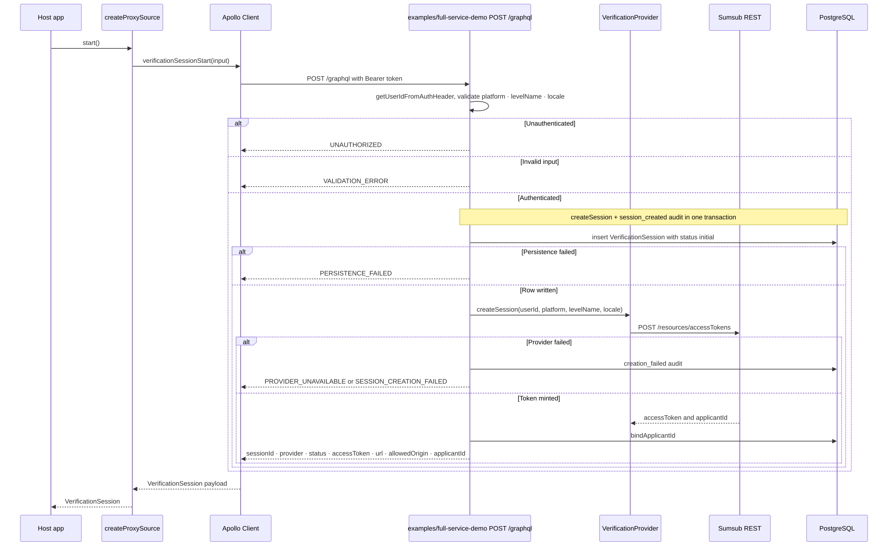
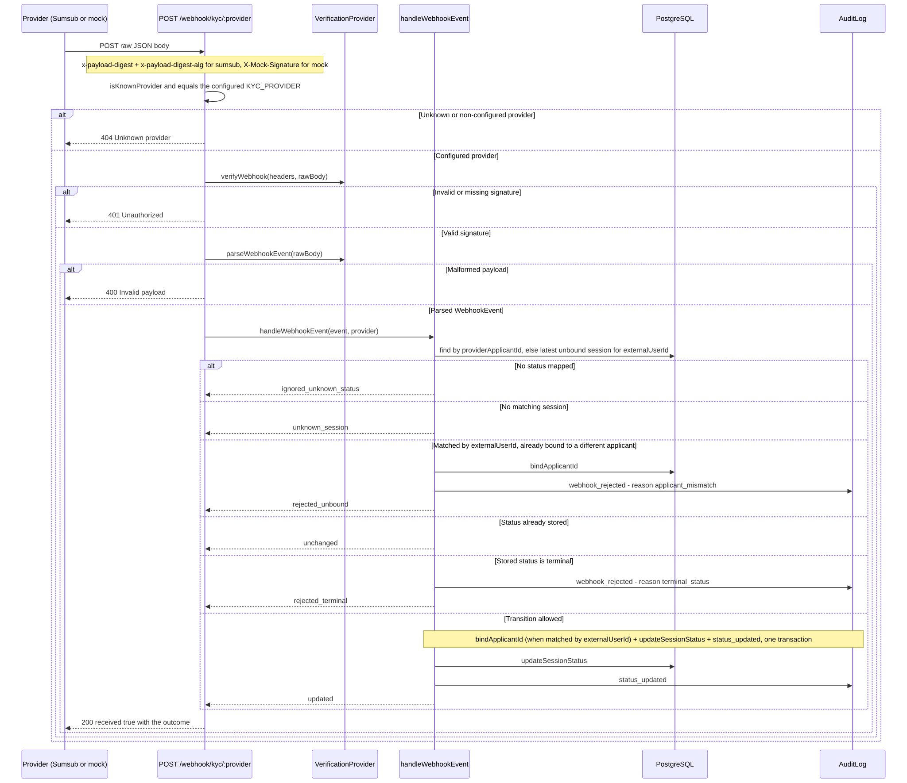

# Architecture - Backend (`apps/api`)

**Part:** backend
**Type:** Express 5 + Apollo Server 5 GraphQL API
**Updated:** 2026-09-06

## Technology Stack

| Category | Technology | Version |
|----------|------------|---------|
| Framework | Express | 5.x |
| GraphQL | Apollo Server | 5.x |
| Language | TypeScript | 6.0.x |
| Query builder | Knex.js | 3.3.x |
| Database | PostgreSQL | 15+ |
| Testing | Vitest | 4.1.x, 100% thresholds |
| HTTP testing | Supertest | 7.x |
| Tracing | OpenTelemetry API + SDK | off unless configured |
| Lint/format | Biome | 2.5.x |
| Dev runner | tsx (watch) | 4.x |

## Architecture pattern

**Provider port + repository layer**, with the GraphQL resolvers as the only place the two meet:

```
HTTP request
    ↓
Express (helmet, per-route rate limit, CORS allow-list)
    ↓
Apollo resolvers  ──►  session.ts / audit.ts   ──►  Knex  ──►  PostgreSQL
    ↓
VerificationProvider (mock | sumsub)  ──►  Sumsub REST
```

## Source structure

| Path | Role |
|------|------|
| `src/app.ts` | Routes, middleware, the hosted-page and webhook handlers |
| `src/server.ts` / `src/index.ts` | Boot (fail-closed config validation) and the process entry |
| `src/schema.ts` / `src/typeDefs.ts` | Resolvers, and the SDL kept free of runtime imports so tooling can load it without a database |
| `src/providers/port.ts` | The `VerificationProvider` interface plus `supportsUserStatusLookup` |
| `src/providers/mock.ts` | Deterministic provider with an in-memory applicant map and a signed mock webhook |
| `src/providers/sumsub/{index,client,config}.ts` | App-token signing, retries, config validation, webhook verify and parse |
| `src/providers/index.ts` | `KYC_PROVIDER` selection, fail-closed for `sumsub` |
| `src/session.ts` / `src/audit.ts` | Repositories, including `applyStatusTransition`/`canTransition` and the metadata allow-list |
| `src/webhook.ts` | `handleWebhookEvent` and the terminal-state guard |
| `src/verificationPages.ts` | The hosted HTML: CSP, the Sumsub page, the mock page, the not-found page - each a consumer of `window.__kycBridge` |
| `src/hosted/bridgeScript.ts` | The `kyc-bridge` page script itself (`post`, `readToken`, the inbound `setToken` listener), run against fake windows in `tests/bridgeScript.test.ts` |
| `src/config.ts` | `validateSecurityConfig`, CORS origins, `PUBLIC_BASE_URL` helpers |
| `src/signature.ts` | Hex HMAC helpers and fail-closed `verifyHexDigest` |
| `src/tracing.ts` / `src/instrumentation.ts` | `withSpan`, `withSpanSync`, `instrumentProvider`, OTel bootstrap |

## Provider port

```ts
export interface VerificationProvider {
  createSession(userId: string, opts: CreateSessionOptions): Promise<ProviderSession>;
  refreshToken(subject: TokenSubject, opts: CreateSessionOptions): Promise<ProviderToken>;
  getStatus(providerApplicantId: string): Promise<VerificationStatus>;
  verifyWebhook(headers: WebhookHeaders, rawBody: string, ip?: string): boolean;
  parseWebhookEvent(rawBody: string): WebhookEvent | null;
  getStatusByUserId?(userId: string): Promise<VerificationStatus>;
}
```

`getStatusByUserId` is an **optional capability**, detected with `supportsUserStatusLookup` - the same Interface-Segregation shape the client packages use for `isLaunchable` / `isTokenRefreshable`. Only the Sumsub adapter implements it, and only the status query uses it, to reconcile a session whose applicant id was never bound.

`instrumentProvider(provider, name)` wraps every method in a span (`kyc.provider.create_session`, `…refresh_token`, `…get_status`, `…get_status_by_user_id`, `…verify_webhook`, `…parse_webhook_event`) so observability is a decorator, not a concern of either adapter.

### Implementations

| Provider | Selected by | Notes |
|----------|-------------|-------|
| `mock` | `KYC_PROVIDER=mock` (default, and any unknown value, with a warning) | Deterministic ids (`mock-applicant-<uuid>`, `mock-token-<uuid>`), an in-memory applicant map, and a hosted page whose buttons POST **signed** webhooks back to this service. Refuses to boot without `ALLOW_INSECURE_DEV=true` - it signs its own webhooks with a key that defaults to `"mock"` and is therefore forgeable |
| `sumsub` | `KYC_PROVIDER=sumsub` | Refuses to boot without `SUMSUB_APP_TOKEN`, `SUMSUB_SECRET_KEY` and `SUMSUB_WEBHOOK_SECRET` |

The Sumsub adapter owns no mapping of its own: `mapSumsubStatus` and `mapSumsubWebhookStatus` come from `@blinkbitcoin/kyc-core/sumsub`, so the backend, the native SDK source and the hosted page can never disagree about what `completed` + `RED` + `FINAL` means.

## GraphQL API

Three operations plus `health`: `verificationSessionStart`, `verificationSessionRefresh`, `verificationSession`. Every field, argument and error code is in [api-contracts.md](api-contracts.md).

[](../diagrams/src/graphql-request-flow.mmd)

Two resolver rules worth stating here:

- **Persist first, then call the provider.** The row and its `session_created` audit entry are written in one transaction *before* the provider is contacted, so a provider outage still leaves an auditable trail (`creation_failed` with the coded reason) instead of a silent gap.
- **Ownership is checked on every read.** `verificationSession` and `verificationSessionRefresh` load by `(id, userId)`; a session belonging to someone else is indistinguishable from a missing one (`SESSION_NOT_FOUND`).
- **`verificationSession` self-heals a non-terminal session.** When the stored status is not `approved`/`finallyRejected`, the resolver asks the provider directly (`provider.getStatus(applicantId)` once an applicant id is bound, else `provider.getStatusByUserId` when the provider supports it) and applies any change through the same conditional write the webhook path uses. This is best-effort reconciliation, not the source of truth - **webhooks are** - and a lookup failure just leaves the stored status in place.

## Webhook processing

`POST /webhook/kyc/:provider` is rate-limited (120/min) and reads the body as **text**, not JSON, because the signature is over the raw bytes.

[](../diagrams/src/webhook-flow.mmd)

| Outcome | When |
|---------|------|
| `ignored_unknown_status` | The payload carries a type this repo does not act on (e.g. `applicantWorkflowCompleted`) |
| `unknown_session` | Neither the applicant id nor the external user id resolves to a session |
| `unchanged` | The stored status already equals the incoming one |
| `rejected_terminal` | The stored status is `approved` or `finallyRejected` - recorded as a `webhook_rejected` audit entry with `reason: 'terminal_status'` |
| `rejected_unbound` | The event is the first one for a session (matched by `externalUserId`), but the applicant id it carries does not match the applicant id the bind attempt found on that session - recorded as a `webhook_rejected` audit entry with `reason: 'applicant_mismatch'` |
| `updated` | Bind (when this is the first event for the session) + `updateSessionStatus` + `status_updated` audit, in one transaction |

All six answer `200` with `{ received: true, outcome }`: a provider retry loop is not an error signal. Only signature failure (`401`), an unparseable body (`400`), an unknown or non-configured provider (`404`) and a genuine processing failure (`500`, which Sumsub retries) diverge.

**The route 404s unless the `:provider` segment is both a known provider and the configured one**, so a mock payload can never drive a Sumsub deployment.

## The hosted page

`GET /hosted/:sessionId` (rate-limited 60/min) renders a single-purpose HTML page:

- A session that is unknown, belongs to a different provider than the one configured, or is already terminal gets the not-found page (`404`), which emits `sessionExpired` over the bridge so the embedding component shows Restart rather than hanging on a session that can no longer progress.
- The access token is minted **fresh on every render** through `provider.refreshToken`; a failure is a `502`, rendered as the same not-found page.
- A per-request nonce drives a strict CSP: `default-src 'none'`, `script-src 'nonce-…' https://static.sumsub.com`, `connect-src https://api.sumsub.com https://*.sumsub.com`, `frame-src https://*.sumsub.com`, `img-src 'self' data: blob: https://*.sumsub.com`, `media-src blob: mediastream:`, `style-src 'nonce-…'`, `base-uri 'none'`, `form-action 'none'`, `frame-ancestors *`. The non-Sumsub (mock) page gets the same shape with the provider hosts removed.
- `Permissions-Policy: camera=(self "https://api.sumsub.com"), microphone=(self "https://api.sumsub.com")` delegates capture to the provider frame.
- `X-Frame-Options` and the three `Cross-Origin-*` headers are explicitly **removed** on this route: the page exists to be embedded. `frame-ancestors *` is deliberate - the client-side origin pin is what actually authenticates the channel, and an embedder allow-list would have to be configured per host app.
- The page emits `kyc-bridge` envelopes and accepts `setToken` in either transport. Its Sumsub branch translates `idCheck.onApplicantLoaded` / `onApplicantSubmitted` / `onApplicantStatusChanged` / `onError` into normalized events using a status table generated from the shared mapping (`buildSumsubStatusTable`), so the page and the backend cannot drift. `locale` (validated and persisted at session-start time) is threaded through to the page and passed to the Sumsub SDK's `withConf({ lang })`, defaulting to `'en'`.

## Observability

The OTel SDK starts only when configured; the `@opentelemetry/api` facade makes every span a no-op otherwise, so `withSpan` is safe to use unconditionally. Span attributes are ids, statuses and types - `kyc.provider`, `enduser.id`, `kyc.platform`, `kyc.session_id`, `kyc.status`, `kyc.webhook.raw_status`, `kyc.webhook.outcome`. **Provider applicant ids are never span attributes**, and no applicant name, document or image ever reaches a log line or a span.

## Database schema

`VerificationSession` and `AuditLog` - see [data-models.md](data-models.md).

## Testing strategy

- **Unit (Vitest, 100% s/b/f/l):** every module under `src/`, with `src/index.ts` (the port-binding bootstrap) the only permanent coverage exclusion.
- **E2E (Vitest + dockerized Postgres on 5433, `make e2e-backend`):** session start / refresh / status, the signed webhook and its state machine, and the hosted page's rendered bridge script.

## Environment variables

See [../development-guide.md](../development-guide.md#environment-variables-reference) for the full table and [security.md](security.md) for which of them are fail-closed.
