# Data Models - Backend

**Part:** backend
**Updated:** 2026-09-10

## Overview

Two tables. One row per verification attempt the backend brokered (proxy mode), keyed by our own id, plus an append-only audit trail. Modes 1 and 2 can run without either - the database exists for the mode that owns session lifecycle.

There is deliberately **no applicant mirror table**: the provider's applicant id is stored on the session row and nothing else about the applicant is copied here.

## Entity Relationship Diagram

[](../diagrams/src/database-erd.mmd)

## Migrations

`packages/kyc-node/src/knex/migrations.ts` (the package's programmatic migration source, named `20260905000000_create_verification_session_and_audit_tables`) creates both tables; `packages/kyc-service/src/migrate.ts` applies it. It is idempotent (`hasTable` guards) and its `down()` drops `AuditLog` before `VerificationSession`, respecting the foreign key.

## Model: `VerificationSession`

### Fields

| Column | Type | Null | Notes |
|--------|------|------|-------|
| `id` | `text` | no | Primary key, generated by the service |
| `userId` | `text` | no | The authenticated subject; indexed |
| `provider` | `text` | no | `mock` or `sumsub` |
| `providerApplicantId` | `text` | yes | **Unique.** Bound when the provider returns it, or later by a webhook. Never exposed as the provider's session id |
| `levelName` | `text` | yes | Provider verification level requested |
| `locale` | `text` | yes | BCP-47-shaped locale (`^[a-z]{2}(-[A-Z]{2})?$`), threaded to the hosted page's SDK config |
| `platform` | `text` | no | `WEB`, `IOS` or `ANDROID` |
| `status` | `text` | no | One of the six `VerificationStatus` values |
| `createdAt` | `timestamp(3)` | no | Defaults to `now()` |
| `updatedAt` | `timestamp(3)` | no | Defaults to `now()` |

### Status values

| Value | Meaning | Terminal |
|-------|---------|----------|
| `initial` | Row created, nothing submitted | no |
| `incomplete` | Started but not submitted | no |
| `pending` | Submitted, awaiting review | no |
| `approved` | Verified | **yes** |
| `declined` | Rejected, resubmission allowed | no |
| `finallyRejected` | Rejected permanently | **yes** |

### Indexes

Primary key on `id`, a unique constraint on `providerApplicantId`, and a non-unique index on `userId` (the webhook fallback path and the "latest session for this user" lookup both use it).

### Relationships

One session has many audit entries (`AuditLog.sessionId`, `ON DELETE CASCADE`).

## Model: `AuditLog`

### Fields

| Column | Type | Null | Notes |
|--------|------|------|-------|
| `id` | `text` | no | Primary key |
| `sessionId` | `text` | no | FK → `VerificationSession.id`, `ON DELETE CASCADE` |
| `action` | `text` | no | See below |
| `timestamp` | `timestamp(3)` | no | Defaults to `now()` |
| `metadata` | `jsonb` | yes | Sanitized allow-list, no PII |

### Action values

| Action | Written by |
|--------|-----------|
| `session_created` | `verificationSessionStart`, in the same transaction as the row |
| `token_refreshed` | `verificationSessionRefresh` |
| `status_updated` | A webhook transition (`source: 'webhook'`) or a reconciled status query (`source: 'api'`) |
| `webhook_rejected` | A webhook that would have downgraded a terminal status (`reason: 'terminal_status'`), or one whose applicant id does not match the session it would otherwise bind (`reason: 'applicant_mismatch'`) |
| `creation_failed` | A provider failure during session start, with the coded `errorCode` |
| `effect_failed` | The host's `effects.onStatusTransition` threw after a committed change, with the coded `errorCode`; the status itself stands |

### Metadata allow-list

Only these nine keys are ever persisted: `userId`, `provider`, `platform`, `levelName`, `status`, `previousStatus`, `source`, `errorCode`, `reason`. Anything else is dropped before the write, so an accidental spread of a provider payload cannot leak applicant data into the audit trail.

## The `SessionStore` port

Persistence is a port of `@blinkbitcoin/kyc-node` (`packages/kyc-node/src/store.ts`), with two implementations: the in-memory store the unit tests and the small examples use, and the Knex store (`src/knex/store.ts`) the service composes (`packages/kyc-service/src/store.ts`).

| Method | Notes |
|--------|-------|
| `createSession(data)` | Writes the row and its `session_created` audit entry together; `data` includes the optional `locale` |
| `getSessionById(id)` / `getSessionByIdForUser(id, userId)` | The owner-scoped form is what the service uses for reads |
| `getSessionByProviderApplicantId(id)` | The webhook's primary lookup |
| `getLatestUnboundSessionForUser(userId, provider)` | The webhook's fallback when only `externalUserId` is known: the newest session for that user and provider that is still **unbound** (`providerApplicantId IS NULL`), ordered by `createdAt desc` |
| `updateSessionStatus(id, status)` | The conditional write: `WHERE status NOT IN (terminal) AND status <> :status`, so the terminal guard is part of the UPDATE itself, not a check before it (the Knex store locks the row `FOR UPDATE`) |
| `bindApplicantId(id, providerApplicantId)` | Idempotent - binds only an unbound session or one already bound to the same applicant; a session bound to a *different* applicant is left untouched and returned as-is, so the caller can refuse the event |
| `appendAuditEntry(entry)` / `listAuditEntries(sessionId)` | Applies the allow-list; newest first |

`applyStatusTransition(id, status, source, opts)` in `src/sessions.ts` is the single write path every status change goes through - optional binding, the conditional status update and the matching audit row, in one transaction. Once that transaction has committed, and only when the outcome is `updated`, the host's optional `effects.onStatusTransition` runs ([backend.md](backend.md#what-the-host-does-with-a-status-change)). A guard test fails if `updateSessionStatus` is called anywhere else.

## Migration commands

```bash
make migrate                                      # apply to the dev database
npm run migrate:test -w packages/kyc-service   # apply to the E2E database (KYC_TEST_DB_PORT, 5104)
```

Migrations are code, not files: a new one is an entry in `KYC_MIGRATIONS` (`packages/kyc-node/src/knex/migrations.ts`) with a name that sorts after the existing ones, tested in the package's `migrations.test.ts` (exact columns, foreign key, index, literal names - an existing `knex_migrations` history must keep matching). `runKycMigrations(db)` applies them through `createKycMigrationSource()`; a host that manages its own Knex migrations can instead register the source with its `knex.migrate`.
