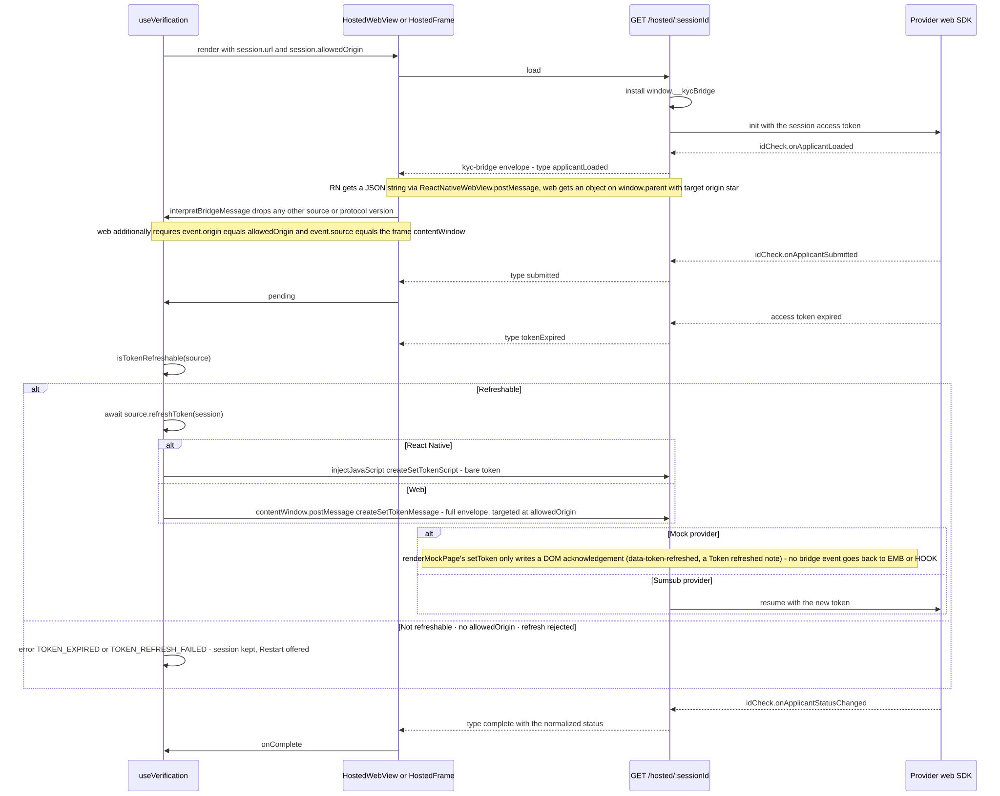

<!-- GENERATED FILE - do not edit. Sources: src/*.mmd; run `make diagrams`. -->

# Diagrams

Pre-rendered SVGs for instant loading; click a diagram to open its editable
Mermaid source in [src/](src/) (which renders natively on GitHub, in VS Code,
and in Obsidian). Regenerate with `make diagrams`.

---

## System Architecture

Mode 1 runs the provider SDK in-process (the host supplies the access
token); mode 2 embeds a page speaking the `kyc-bridge` protocol; mode 3
adds the proxy GraphQL session on `apps/api`. Only `createProxySource`
loads Apollo - the `/hosted` entries never reach it.

---

## Data Flow Diagram (proxy mode)

Modes 1 and 2 stop after the token: only the proxy mode persists a
`VerificationSession` row and lets webhooks move its status.

---

## Verification Flow Process

One machine, both platforms (`packages/kyc-core/src/verification/machine.ts`).
`offline` and `permissionDenied` deliberately do not fire `onError` - they
are recoverable states with their own screen.

---

## Database ERD

`approved` and `finallyRejected` are terminal and can never be downgraded
by a late or replayed webhook. `declined` is not terminal - a RETRY
rejection lets the applicant resubmit.

---

## Component Hierarchy

The host app writes `config.ts` -> `apollo.ts` -> `source.ts` and renders
one component. Which embedding primitive appears is decided by the source:
`isLaunchable` wins over `isMountable`, which wins over embedding a url.

---

## Webhook Flow

The route 404s unless the path segment is both a known provider and the
configured one, so a mock payload can never drive a Sumsub deployment.

---

## GraphQL Request Flow

The row is written before the provider is called, so a provider outage
still leaves an auditable `creation_failed` trail.

---

## Hosted Bridge Flow

Page -> app always carries the full `kyc-bridge` envelope. App -> page has
two transports: `createSetTokenScript` (bare token, injected by
react-native-webview) and `createSetTokenMessage` (full envelope, posted
to the pinned origin by the web package).
