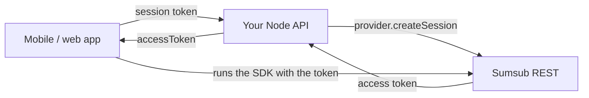
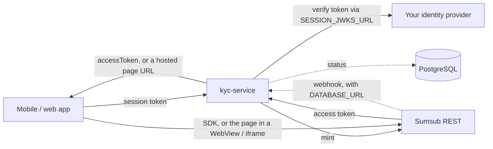

# Running identity verification in production

For the people who take a working sandbox integration live: the Sumsub
account owner, the backend developer, whoever operates the deployment, and
the mobile developer. Everything below is about the **access token** - the
one server-side call every mode needs, minted for a user your backend has
authenticated - and, where a deployment also runs sessions, the service
around it.

Two shapes, both supported, same environment contract:

- **Tier A - in-process.** The host's own Node API mints. Nothing extra is
  deployed; the recipe is the
  [`kyc-node` README](../../packages/kyc-node/README.md#mint-a-token-for-the-native-sdk-mode-1)
  and the runnable examples are
  [`examples/access-token-demo`](../../examples/access-token-demo/README.md)
  (one mutation on an existing API) and
  [`examples/serverless-handler-demo`](../../examples/serverless-handler-demo/README.md)
  (the preset behind a route handler).
- **Tier B - the service.** `@blinkbitcoin/kyc-service` runs as a function
  or a container next to the host's API, which keeps the session. Its deploy
  targets are in
  [`packages/kyc-service/README.md`](../../packages/kyc-service/README.md#deploy).

> **Unverified against a production Sumsub account.** Every finding this
> repository documents comes from the sandbox; the production behaviour is
> assumed to match and stays unverified until a production account runs the
> checklist in section 6 ([sumsub-lessons.md](../integration/sumsub-lessons.md)
> is the record of what the sandbox passes taught). Treat that checklist as
> the thing that closes it.

---

## 1. What runs where

### Tier A: the host's API mints in-process



The host API imports `@blinkbitcoin/kyc-node` and gains one endpoint's worth
of behaviour inside its own process: the mint, plus a health check if it
mounts the preset. Nothing else is deployed, no database is involved, and
the Sumsub credentials never leave the API's own secret store. The SDK asks
the app for a token again when one expires, so the mint is also the refresh.

### Tier B: the service is deployed



The service holds the Sumsub credentials; the host keeps the one thing only
it knows - who the caller is (a JWKS endpoint or a shared HS256 secret).
Access tokens are always on; setting `DATABASE_URL` adds the sessions half
(the hosted page, the provider webhook, the GraphQL API, the Postgres
store).

### Pick a tier and a target

| Situation | Tier | Target |
|---|---|---|
| The host API is Node and can take a<br>dependency | A | its own deployment |
| The host API is not Node, or must not hold<br>Sumsub credentials | B | the [deploy table](../../packages/kyc-service/README.md#deploy) |
| The hosted page, webhooks, the status query<br>or the GraphQL API are wanted (modes 1 and 3) | B | a target with Postgres |
| Only access tokens, on an edge runtime | B | Cloudflare (tokens only) |
| The host is NixOS and the fleet is declared<br>in Nix | B | the [NixOS row](../../packages/kyc-service/README.md#deploy),<br>template `packages/kyc-service/deploy/nix/` |

Tier A and Tier B mint the same token and are indistinguishable to the app:
the mobile side in section 5 is identical for both.

---

## 2. Sumsub go-live (account owner)

Going live is mostly Sumsub's process, not ours. Do not expect any of it to
be a code change here. The sandbox steps this repo was verified against are
[sumsub.md](../integration/sumsub.md) section 1; production repeats them in
the production space of the dashboard.

**Sumsub's steps** (in the Sumsub dashboard, production space):

1. **The production App Token.** Create it in the production space (App
   Tokens) and copy the token and its secret key - the secret is shown
   once. A sandbox token starts with `sbx:`; a production token does not,
   and that prefix is the one tell the boot guard uses (section 4): under
   `KYC_ENV=production` a `sbx:` token refuses to boot.
2. **The verification levels.** Level names are per account and per space:
   the production space has its own, and `basic-kyc-level` (this repo's
   default) exists only if you created it there. Every name the backend
   uses - `SUMSUB_LEVEL_NAME`, whatever a `levelFor` hook or the
   `access-token-demo`'s `KYC_LEVEL_*` returns - must exist in production.
   Confirm each level has both an identity document and a liveness step;
   a document-only level never opens the camera.
3. **The webhook** (Tier B with sessions only): register
   `<PUBLIC_BASE_URL>/webhook/kyc/sumsub`, method POST, subscribed to at
   least `applicantReviewed`, `applicantPending`, `applicantCreated`,
   `applicantOnHold` and `applicantReset`; copy its secret key and note the
   digest algorithm. The backend reads the algorithm from the
   `x-payload-digest-alg` header and supports SHA-1, SHA-256 and SHA-512;
   the secret is `SUMSUB_WEBHOOK_SECRET`.
4. **Allowed origins for the Web SDK** (the hosted page on the web): if the
   production space restricts the domains the Web SDK may load from, add
   the origin of `PUBLIC_BASE_URL` - the page is served from there, inside
   the host's iframe.
5. **The review policy.** Sandbox applicants are auto-reviewed; production
   ones go through the account's review queue and its rules. Nothing here
   changes, but the statuses the app sees (`pending`, then a terminal one)
   now take as long as that review does.

**Our rule**: the dashboards are sandbox-only for everyone working in this
repository. A production token never touches a developer machine, a `.env`
file, or CI (`make sumsub-env` writes a sandbox `.env`; the live tier
[live-e2e-ci.md](live-e2e-ci.md) runs on sandbox secrets and must stay
that way).

---

## 3. Backend developer

### Tier A - the host API mints

Two names from `@blinkbitcoin/kyc-node`, wired once at boot:

```ts
import { accessTokenProviderFromEnv } from '@blinkbitcoin/kyc-node';
import { createAccessTokenRouter } from '@blinkbitcoin/kyc-node/express';

const provider = accessTokenProviderFromEnv(process.env); // checked at boot

app.use(createAccessTokenRouter({
  provider,
  authenticate: req => yourAuth(req.headers.authorization),   // user id or null
  levelFor: (input, { userId }) => yourLevelFor(userId),       // the host decides
}));
```

`createAccessTokenApp` is the same surface with no framework - one Fetch
entry point for a route handler, a Worker or a plain Node server. Both
serve `POST /verification/token` and `GET /health`, and nothing else.

**The mutation alternative.** A host that already has a GraphQL API adds
one mutation instead of mounting a route: the mint without any HTTP
surface is `provider.createSession(userId, { platform, levelName })`,
called from the resolver once the resolver has authenticated the caller
and picked the level from the host's own data.

```ts
// examples/access-token-demo/src/session.ts
export const createStartSession = (env = process.env) => {
  const provider = accessTokenProviderFromEnv(env);          // once, at startup
  return (userId, platform, levelName) =>
    provider.createSession(userId, { platform, levelName });
};

// examples/access-token-demo/src/schema.ts (the resolver)
verificationAccessToken: async (_parent, { platform, tier }, context) => {
  if (!context.userId) throw new Error('Unauthenticated');
  const levelName = levelFor(tier);                          // the host's own decision
  return context.startSession(context.userId, platform, levelName);
},
```

The whole runnable shape is
[`examples/access-token-demo`](../../examples/access-token-demo/README.md)
(`src/session.ts`, `src/level.ts`, `src/schema.ts`).

What the host still owns, in every spelling:

- **The session.** `authenticate` returns the user id or `null`; the
  package never sees the token. `null` is `401`. The user id is the
  external user id Sumsub files the applicant under, so it must be stable
  for the user's lifetime and must never be a session id.
- **The level.** The `levelFor` hook receives the caller's *validated*
  input and returns the level actually minted, so a client value can never
  pick a cheaper level. To refuse the request - the user is not eligible,
  say - throw `Errors.validationError(message)`, which comes back as
  `400 { error: 'VALIDATION_ERROR', message }` (`Errors.unauthorized()` →
  `401`); a provider failure is `502`.
- **The edge concerns**: CORS, security headers, rate limits. The worked
  policy is the service's own (`packages/kyc-service/src/app.ts` and
  `src/server.ts`) - copy from it rather than inventing one.
- **Timing.** An access token lives `SUMSUB_TOKEN_TTL_SECS` (default 600
  s) and the SDK asks for a new one through the same callback when it
  expires, so mint when the user opens the verification screen, never
  earlier, and never cache one.

### Tier B - the host API answers one callback

The host does not mint. It exposes, instead, a **JWKS endpoint**
(`SESSION_JWKS_URL`) or shares an HS256 secret (`SESSION_HS256_SECRET`,
alias `JWT_SECRET`) so the service can turn the app's bearer token into a
user id - the id Sumsub sees as the external user id. `SESSION_ISSUER`,
`SESSION_AUDIENCE` and `SESSION_USER_CLAIM` (default `sub`) pin which
tokens count.

With sessions on, the host also decides whether to read status from the
service's GraphQL API (`verificationSession`, mode 3) or from its own
systems fed by the same webhook - the service persists one row per
attempt and the terminal-state guard means a replayed callback never
downgrades an `approved` user ([proxy.md](../integration/proxy.md)).

Rotation in both tiers is a restart: the Sumsub settings are checked once
at boot (the adapter reads them per call, but the guard does not re-run),
so replacing the token means rolling the deployment.

---

## 4. DevOps

### Tier B: deploy

Every target runs the same image or the same package, on the same
environment contract, with the same `/health`. The table of targets - the
image, Compose, Kubernetes, NixOS, Cloud Run/Fly/Render/Railway, Lambda,
Vercel, Cloudflare - and the exact command per row lives with the templates
it refers to:
[`packages/kyc-service/README.md#deploy`](../../packages/kyc-service/README.md#deploy).
The templates themselves are
[`packages/kyc-service/deploy/`](../../packages/kyc-service/deploy/) and
ship in the published tarball; their only inputs are environment
variables. `make deploy-check` validates them, `make docker-build` and
`make docker-smoke` boot the image in both capability modes.

Two things the table decides for you:

- **Capabilities.** Every row serves access tokens. Sessions need
  `DATABASE_URL` and a runtime that can open a Postgres connection, so
  Cloudflare is tokens-only - the boot guard refuses `DATABASE_URL` there
  and names the target to use instead.
- **The migrate step.** Only when sessions are on, once per database (and
  after an upgrade that adds a migration): `node dist/node.js migrate` in
  the image, `npx kyc-service migrate` from the package. The templates
  wrap it as Compose's `migrate` profile and the Kubernetes
  `kyc-service-migrate` Job.

### The environment

`packages/kyc-service/.env.example` is the authoritative list, with
comments. In production the ones that matter:

| Variable | Production setting |
|---|---|
| `KYC_PROVIDER` | `sumsub` |
| `KYC_ENV` | `production` (the image already sets it) |
| `KYC_ALLOW_DEMO` | unset; `true` only for staging on the sandbox |
| `SESSION_JWKS_URL` | the host's key set; or `SESSION_HS256_SECRET` |
| `SESSION_ISSUER`,<br>`SESSION_AUDIENCE` | enforced when set - set them |
| `SESSION_USER_CLAIM` | the claim carrying the user id (default `sub`) |
| `DATABASE_URL` | only when sessions are wanted |
| `PUBLIC_BASE_URL` | the deployment's public https base; required once<br>sessions are on (the hosted page URL and the origin<br>clients pin `postMessage` to derive from it) |
| `SUMSUB_APP_TOKEN`,<br>`SUMSUB_SECRET_KEY` | the production token from section 2 (no `sbx:`) |
| `SUMSUB_WEBHOOK_SECRET` | required when sessions are on |
| `SUMSUB_LEVEL_NAME` | a level that exists in the production space |
| `SUMSUB_BASE_URL`,<br>`SUMSUB_TOKEN_TTL_SECS`,<br>`SUMSUB_REQUEST_TIMEOUT_MS` | tuning; `https://api.sumsub.com`, 600 s, 10 000 ms |
| `CORS_ALLOWED_ORIGINS` | the app origins; empty = same-origin only |
| `ALLOW_INSECURE_DEV` | never set in production |
| `OTEL_*` | standard OpenTelemetry; tracing off unless set |
| `PORT`, `TRUST_PROXY`,<br>`RATE_LIMIT_*_PER_MIN` | container only (defaults 5100; 60/60/120/100 per min) |

**Tier A** takes the same table **minus everything only the service
reads**: `SESSION_*`, `DATABASE_URL`, `PUBLIC_BASE_URL`,
`SUMSUB_WEBHOOK_SECRET`, `CORS_ALLOWED_ORIGINS`, `ALLOW_INSECURE_DEV`,
`OTEL_*` and the container-only row. The host API already has a session,
picks its own level in the `levelFor` hook, and brings its own CORS,
telemetry, port, proxy and limits. What is left is `KYC_PROVIDER`,
`KYC_ENV`, `KYC_ALLOW_DEMO` and the `SUMSUB_*` settings, applied to the
host API's own deployment.

### The secrets, per platform

Every secret is a one-line value, so there is no file to mount anywhere:

| Platform | How |
|---|---|
| Docker / Compose | `--env-file` (the image reads nothing else), or Compose<br>`secrets` exported into the environment by an entrypoint<br>of your own |
| Kubernetes | one Secret, `deploy/k8s/secret.yaml`, consumed with<br>`envFrom` by the Deployment and the migrate Job |
| NixOS | the environment file `deploy/nix/configuration.nix` names,<br>written by agenix / sops-nix or root-owned |
| Vercel, Cloudflare,<br>other PaaS | the platform's env UI (Cloudflare: `wrangler secret put`) |

`SUMSUB_SECRET_KEY` signs every REST call and `SUMSUB_WEBHOOK_SECRET`
verifies every delivery: rotating either in the dashboard is a redeploy
with the new value, and the old one stops working the moment Sumsub
retires it.

### The boot guard

`validateConfig` runs from the environment alone and lists **every**
problem at once, with the capabilities that were on, then refuses to
start - a container fails to boot, a function fails at first import. It
refuses:

- no session source (`SESSION_JWKS_URL` / `SESSION_HS256_SECRET`) unless
  `ALLOW_INSECURE_DEV=true`;
- with sessions on: no `PUBLIC_BASE_URL`, or one that is not an absolute
  http(s) URL;
- an unknown `KYC_PROVIDER`, or `sumsub` without the settings a mint
  needs (`SUMSUB_APP_TOKEN`, `SUMSUB_SECRET_KEY`);
- the mock provider unless `ALLOW_INSECURE_DEV=true` - it signs its own
  webhooks with a default key, so anyone who can reach the route could
  forge an `approved`;
- under `KYC_ENV=production`: the mock provider, and a Sumsub app token
  still carrying the sandbox `sbx:` prefix - `KYC_ALLOW_DEMO=true` is the
  one bypass, for a production-shaped staging deployment;
- sessions on with Sumsub and no `SUMSUB_WEBHOOK_SECRET` (unless
  `ALLOW_INSECURE_DEV=true`);
- `DATABASE_URL` on the Cloudflare runtime.

`KYC_ENV=production` does one more thing that is not a refusal: GraphQL
introspection is off, so a deployment with sessions on does not publish its
schema.

`NODE_ENV` gates none of this: every Node image sets it, so it says nothing
about the verification configuration. Tier A gets the same provider checks
from `accessTokenProviderFromEnv` (`SumsubConfigError`,
`ProductionConfigError`), at the host's own boot.

### In front of the service

- **TLS terminates at your proxy**; the service listens on plain HTTP on
  `PORT`. `TRUST_PROXY=1` makes rate limiting key on the first
  `X-Forwarded-For` hop, so run exactly one trusted proxy in front.
- **Do not add `X-Frame-Options` or a `frame-ancestors` restriction** on
  `/hosted/*`. The page is meant to be embedded by host apps whose origin
  the service cannot know; it ships `frame-ancestors *` on purpose, and the
  trust boundary is the client-side origin pin
  ([security.md](../architecture/security.md#the-hosted-page-and-the-embedding-boundary)).
- **Do not strip `Permissions-Policy`** on `/hosted/*`. The page delegates
  `camera` and `microphone` to the provider's frame and nothing else; a
  proxy that rewrites it breaks capture inside the iframe.
- **`Cache-Control: no-store`** is set by the page; keep it. The session id
  in the URL is a bearer capability handed to one client.
- **Rate limits are built in** (`/verification/token` 60/min, `/hosted/:sessionId`
  60/min, the webhook 120/min, `/graphql` 100/min - `RATE_LIMIT_*_PER_MIN`
  tunes them - and 64 kB bodies), and the security headers are on every
  response. Add your own edge limits on top, not instead.

### Health and shutdown

- `GET /health` answers `{ status, capabilities, timestamp }`, so a
  deployment says which capabilities it is serving. It is the readiness
  and liveness probe in the Kubernetes template and the image's
  `HEALTHCHECK`.
- **SIGTERM** stops the listener and drains in-flight requests before
  exiting, so a rolling deploy loses nothing. Give the orchestrator a
  grace period longer than the slowest Sumsub call
  (`SUMSUB_REQUEST_TIMEOUT_MS` plus retries).
- An access token is a credential for the applicant's own verification:
  the service does not log one, and anything that captures the service's
  output (a log shipper, a CI artifact) should be treated as carrying one
  anyway - which is why [live-e2e-ci.md](live-e2e-ci.md) does not upload
  the service log. Applicant ids never reach logs or spans either
  ([security.md](../architecture/security.md)).

---

### Observability

Set the three `OTEL_*` variables to export traces; every provider call and
webhook is a span. Applicant data never reaches spans or the audit log (the
allow-list is the package's `audit.ts`).

## 5. Mobile developer

Nothing about production changes on the app side. Mode 2 (the native SDK)
installs the package and the provider SDK peer:

```sh
npm i @blinkbitcoin/kyc-react-native @sumsub/react-native-mobilesdk-module
cd ios && bundle exec pod install
```

Point the source at the mint - the host API in Tier A, the service in
Tier B - and render the component:

```tsx
import { Verification } from '@blinkbitcoin/kyc-react-native';
import { createSumsubNativeSource } from '@blinkbitcoin/kyc-react-native/sumsub';

const source = createSumsubNativeSource({
  // POST /verification/token on your backend, with the app's own session token
  getAccessToken: async () => (await yourApi.verificationAccessToken('IOS')).accessToken,
});

<Verification
  source={source}
  onComplete={({ status }) => {}}
  onError={({ code, message }) => {}}
  onCancel={() => {}}
/>
```

`getAccessToken` doubles as the SDK's own expiry handler, so there is
nothing to refresh: the SDK calls it again and the backend mints again.

Mode 1 (the hosted page) needs Tier B with sessions and the `/hosted`
entry - `createHostedSource({ getSession })` over the service's start
mutation, the `allowedOrigin` derived from `PUBLIC_BASE_URL`
([hosted.md](../integration/hosted.md)); mode 3 adds the Apollo peers and
`createProxySource` ([proxy.md](../integration/proxy.md)). Web is the same
code from `@blinkbitcoin/kyc-react`. Error codes:
[error-codes.md](../integration/error-codes.md).

---

## 6. Verification checklist

Nothing here is confirmed until these pass against the **production**
account, levels and token. Do not run the automated live tier against
production: `make e2e-live` submits real applicants and exists for the
sandbox.

- [ ] `make sumsub-check` with the production `SUMSUB_*` values in the
      environment (never in a committed file): app-token auth and the
      level resolve, and a throwaway token mints.
- [ ] `curl` the mint with a **real session token** and confirm a `200`
      with an access token:

      ```sh
      curl -s https://kyc.example.com/verification/token \
        -H "authorization: Bearer $TOKEN" -H 'content-type: application/json' \
        -d '{"platform":"IOS"}'
      ```

      An expired or wrong-issuer token must answer `401`.
- [ ] The **level actually minted** is the host's: a request naming a
      different `levelName` gets the level `levelFor` decided (or the
      provider's default), visible on the applicant in the dashboard.
- [ ] One **real applicant** on a phone: the SDK opens on the token, the
      document and liveness steps run, the applicant appears in the
      production space under the app's user id, and the app's
      `onComplete` fires.
- [ ] The **guard refuses demo values**: boot the same deployment with the
      sandbox token or `KYC_PROVIDER=mock` and confirm it refuses to start,
      naming the offending setting.
- [ ] `GET /health` reports the capabilities the deployment is meant to
      serve (and only those).
- [ ] With sessions on: the migrate step ran, `POST /webhook/kyc/mock`
      answers `404`, an unsigned `POST /webhook/kyc/sumsub` answers `401`,
      and a reviewed applicant's webhook reaches the service and updates
      the stored status (`verificationSession` over GraphQL, or the
      hosted page's completion).

When the first four items pass, add a production pass to
[sumsub-lessons.md](../integration/sumsub-lessons.md) - it is the record of
what remains unverified.

---

## 7. Failure modes

| Symptom | Meaning | Fix |
|---|---|---|
| Refuses to boot naming<br>`SUMSUB_APP_TOKEN=sbx:…` | `KYC_ENV=production` with the<br>sandbox token | the production token<br>(section 2) |
| Refuses to boot naming the<br>mock provider | `KYC_ENV=production` with<br>`KYC_PROVIDER=mock`, or the mock<br>without `ALLOW_INSECURE_DEV` | set `KYC_PROVIDER=sumsub`<br>and its settings |
| Refuses to boot: no session<br>verification | neither `SESSION_JWKS_URL` nor<br>`SESSION_HS256_SECRET` is set | the host's key set or secret<br>(section 3, Tier B) |
| `401` from the mint | the host rejected the token: wrong<br>issuer, audience, claim or expiry | check `SESSION_*` against the<br>token the app actually sends |
| `400 VALIDATION_ERROR` from<br>the mint | a platform outside `WEB`, `IOS`,<br>`ANDROID`, or the `levelFor` hook<br>refused the user | the message says which |
| `502 PROVIDER_UNAVAILABLE` | Sumsub refused or timed out<br>(credentials, a level that does not<br>exist in this space, an outage) | the service log names the<br>upstream status; check the<br>level and the token's space |
| The SDK opens and closes at<br>once | the level has no steps the SDK<br>can run, or the token was minted<br>for another platform | check the level (section 2)<br>and the `platform` the app sends |
| Status never leaves `pending` | production review is manual and<br>slow, or the webhook never arrived | the dashboard's review queue;<br>section 6's webhook checks |
| `404` from the webhook | the URL names a provider other<br>than the configured one | register<br>`/webhook/kyc/sumsub` |
| `401` from the webhook | the signature did not verify: wrong<br>secret, or a body re-serialised on<br>the way in | `SUMSUB_WEBHOOK_SECRET`; a<br>proxy must pass the raw body |
| Refuses to boot on Cloudflare<br>naming `DATABASE_URL` | sessions asked for on a runtime<br>with no Postgres driver | the container or the Node<br>target for sessions |

More detail per layer:
[error-codes.md](../integration/error-codes.md) (app-facing codes),
[sumsub-lessons.md](../integration/sumsub-lessons.md) (the Sumsub rules
behind them), [live-e2e-ci.md](live-e2e-ci.md) (the same failures as seen
from CI).
